# Trabalho Pŕatico - Diferenças entre SQL e NoSQL - Banco de Dados II
Trabalho prático com o objetivo de comparar a mesma base de dados construída em SQL (Postgres) e NoSQL (MongoDB)

#### Autores: 
- Pedro Matias
- Túlio Bittar

## Introdução
Para efeitos de comparação, o SGBD utilizado como base para a realização do trabalho foi o PostgresSQL, enquanto o MongoDB foi o banco escolhido para realizar as mesmas consultas em NoSQL.

#### Sobre o MongoDB
O MongoDB é um banco de dados não-relacional orientado a documentos. Bancos de dados orientados a documentos utilizam o conceito de dados e documentos autocontidos e autodescritivos, o que significa que o documento em si já define como ele deve ser apresentado e qual é o significado dos dados armazenados na sua estrutura.

É uma característica desse tipo de banco conter todas as informações importantes em um único documento, ser *schemaless*, possuir identificadores únicos universais (UUID) e também permitir redundância e inconsistência de dados.

Algumas caracteristicas do MongoDB podem ser citadas:
- É open source e escrito em C++
- De 7 a 10x mais rápido quando comparado com SQL tradicional
- Ocupa menos espaço de armazenamento
- Garante alta escalabilidade e flexibilidade

## Instalação
Para efetuar a instalação do MongoDB, existem tutoriais disponíveis na própria documentação oficial:
  1. [Instalção em ambientes Linux/Unix](https://docs.mongodb.com/manual/administration/install-on-linux/)
  2. [Instalação no Windows](https://docs.mongodb.com/manual/tutorial/install-mongodb-on-windows/)

## A base de dados SQL

Utilizando o PostgresSQL, foi criado um banco dados qualquer. Através do script ```scriptBDTreinamento.sql```, foi inicializado o banco contendo 4 tabelas principais:
 - Empregados
 - Cursos
 - Departamentos
 - Historico_emprego

 As tabelas são relacionadas de acordo com a figura a seguir:

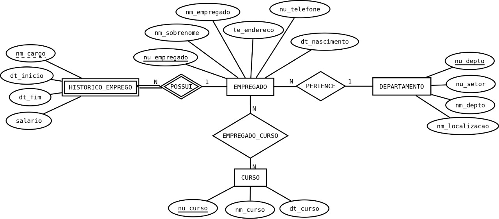
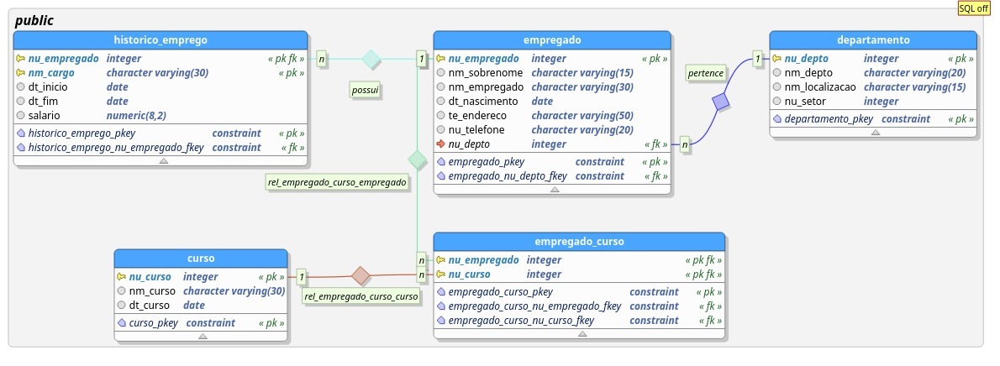


## A base de dados NoSQL

O intuito é criar uma base de dados com capacidade de realizar as mesmas consultar demandadas no SQL.

Para isso, após realizada a instalação e a devida inicialização do servidor *mongodb*, é possível criar o *database* e realizar as consultas.

Primeiramente, clone o respositório ou realize o download dos arquivos fonte disponibilizados. Navegue até o diretório em que se encontram os arquivos para dar continuidade.

Através do terminal, digite o seguinte comando para inicializar o database:
```
mongo nome_do_database < scriptMongoTreinamento.js
```

Esse comando irá inserir os dados do script no database (*nome_do_database*) escolhido. É importante ressaltar que não há necessidade de criação de database previamente. Apenas executar esse comando irá inicializar o database com os respectivos dados.

As collections foram modeladas de acordo com a figura abaixo:

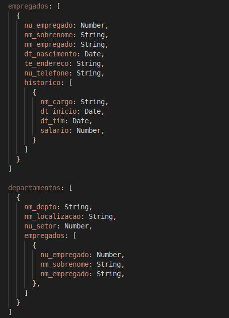
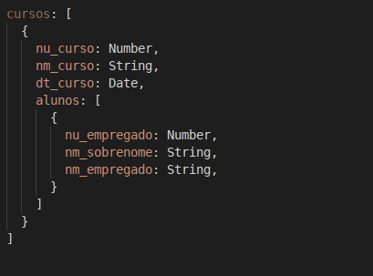

## Realizando as Queries

**1. Selecionar o nome e sobrenome dos empregados que já tiveram cargo “Accountant”.**

- Em SQL:
```SQL
SELECT e.nm_empregado, e.nm_sobrenome
FROM empregado e INNER JOIN historico_emprego h ON e.nu_empregado = h.nu_empregado
WHERE h.nm_cargo = 'Accountant';
```

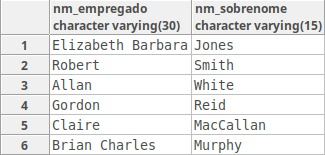

- Em NoSQL
```javascript
db.empregados.find({ 'historico.nm_cargo': 'Accountant' }, { nm_sobrenome: 1, nm_empregado: 1 }).pretty();
```
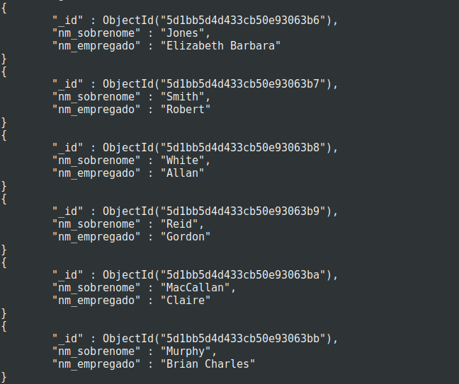

Seguindo a mesma lógica da consulta 1, a parte ``` { 'historico.nm_cargo': 'Accountant' } ``` consulta no array ``` historico ``` todos os cargos com nome *Accountant*, enquanto a segunda parte ``` { nm_sobrenome: 1, nm_empregado: 1 } ``` faz a projeção para exibir apenas nome e sobrenome.

Percebe-se que, no MongoDB, todo o histórico de empregados já está contido no documento responsável por descrever o empregado. Portanto, não há necessidade de ```JOINS```.

**2. Selecionar o nome do departamento e a quantidade de empregados por departamento, apresentando o resultado em ordem crescente de nome de departamento**

- Em SQL:
```SQL
SELECT d.nm_depto, count(e.nu_depto)
FROM departamento d INNER JOIN empregado e ON d.nu_depto = e.nu_depto
GROUP BY d.nm_depto
ORDER BY d.nm_depto ASC;
```

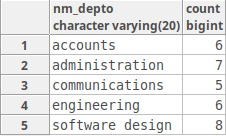

- Em NoSQL
```javascript
db.departamentos.aggregate(
  { $project: { 
    nm_depto: '$nm_depto', count: { $size: '$empregados' } 
  },
  { $sort: { nm_depto: 1 } }
).pretty();
```

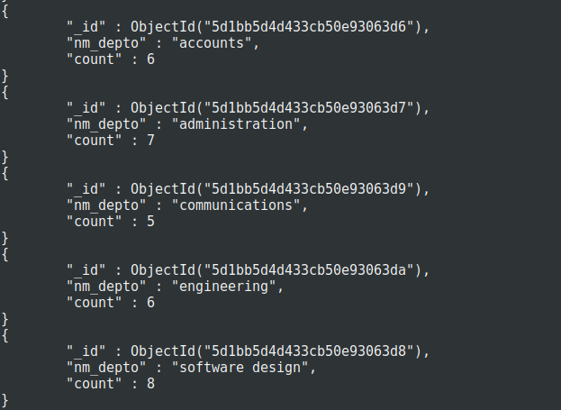

Na modelagem NoSQL, como os empregados estão inseridos dentro do documento de cada departmento (redundância), basta fazer uma projeção dos campos a serem exibidos e contar o tamanho do array ```empregados``` de cada documento de departamento. Diferentemente da abordagem relacional, não é necessáio consultar outras entidades para retornar a consulta.

**3. Selecionar o nome e sobrenome dos empregados que ocuparam um cargo com salario maior que 25000**.

- Em SQL:
```SQL
SELECT distinct e.nm_empregado, e.nm_sobrenome
FROM empregado e INNER JOIN historico_emprego h ON e.nu_empregado = h.nu_empregado
WHERE h.salario > 25000;
```

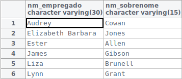

- Em NoSQL
```javascript
db.empregados.find({ 'historico.salario': { $gt: 25000 } }, { nm_sobrenome: 1, nm_empregado: 1 }).pretty();
```

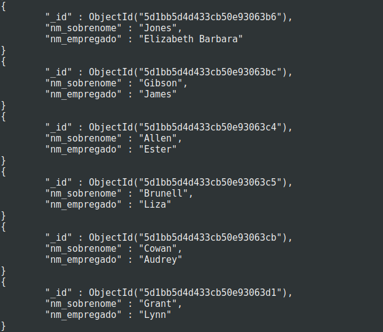

Seguindo a mesma lógica da consulta 1, percebe-se que, no MongoDB, todo o histórico de empregados já está contido no documento responsável por descrever o empregado. Portanto, não há necessidade de ```JOIN```, como no PostgreSQL

**4. Update**

- Em SQL:
```SQL
UPDATE HISTORICO_EMPREGO
SET salario = 32000
WHERE nm_cargo = 'Software Engineer';
-- Verificacao
SELECT *
FROM HISTORICO_EMPREGO
ORDER BY nu_empregado, dt_inicio;
```
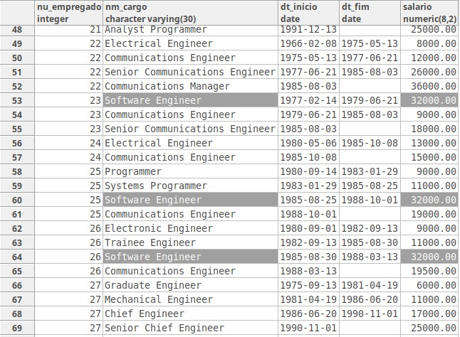

- Em NoSQL
```javascript
db.empregados.updateMany({ 'historico.nm_cargo': 'Software Engineer' }, { $set: { 'historico.$.salario': 320000 } });
// Verificacao
db.empregados.find({ 'historico.nm_cargo': 'Software Engineer' }).pretty();
```
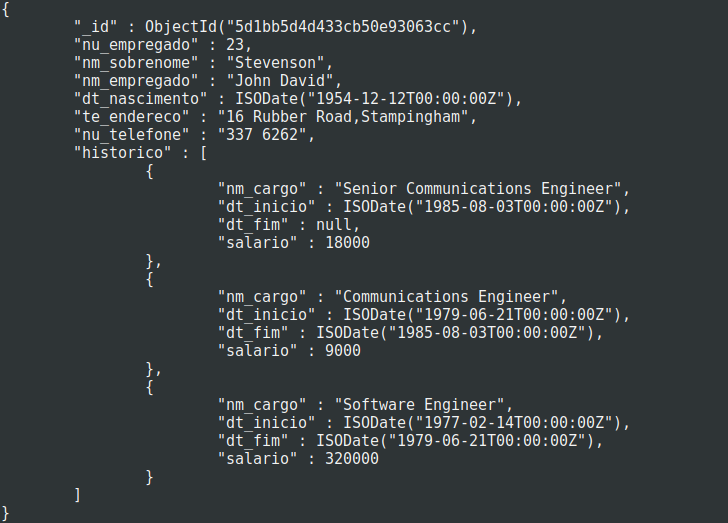
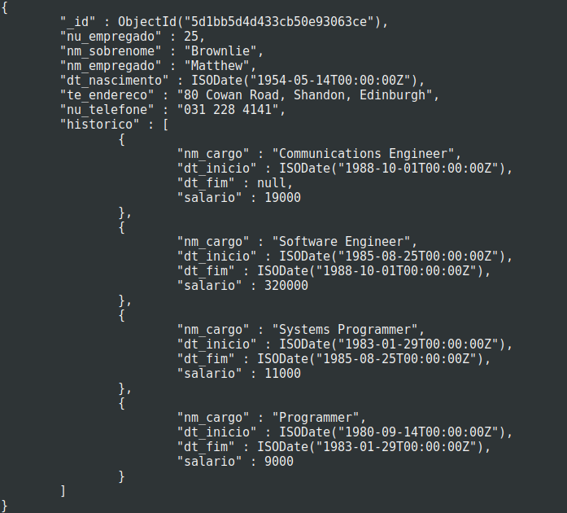
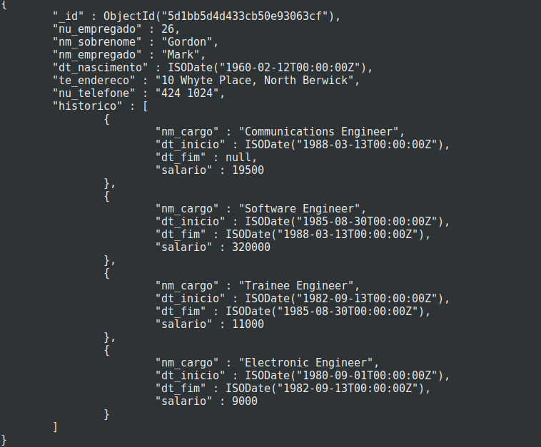

Apesar existir redundância de empregados nas collections ``` departamentos ``` e ``` cursos ```, como apenas o salário cujos cargos tem nome de ```Software Engineer``` foram atualizados, e nas collections ``` departamentos ``` e ``` cursos ``` não existem informações sobre histórico, basta atualizar os salarios apenas em ``` empregados ```.

Se o atributo de atualização dosse ``` nm_sobrenome ``` do empregado, por exemplo, seriam necessários mais updates para atualizar o mesmo dados nas outras collections (já que este campo é persistido) para evitar inconsistência. Esta preocupação não existe para o SQL.

**5. Remoção**

- Em SQL:
```SQL
DELETE FROM HISTORICO_EMPREGO
WHERE nu_empregado = 8;
-- Verificacao
SELECT *
FROM HISTORICO_EMPREGO;
```
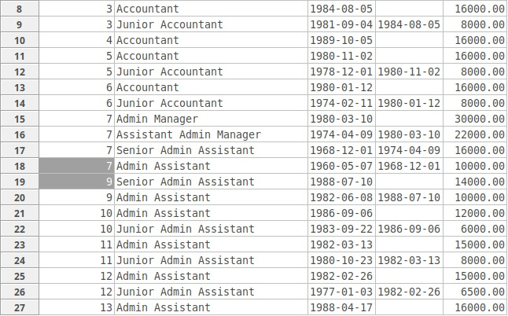

- Em NoSQL
```javascript
db.empregados.update({ nu_empregado: 8 }, { $set: { historico: [] } });
// Verificacao
db.empregados.find({ nu_empregado: 8 }).pretty();
```

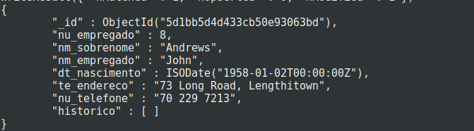
 
Basta encontrar o empregado pelo seu numero e setar o array ``` historico ``` como vazio. Não há grandes diferenças entre os dois modelos de dados.

# Conclusão

É totalmente possível ter o mesmo sistema utilizando um banco de dados relacional e um não relacional, cabendo apenas à situação e ao planejamento decidir qual das duas soluções utilizar

No caso de bancos relacionais, a modelagem deve ser feita de modo ao evitar ao máximo a repetição de dados e a normalização é uma das grandes prioridades. Isso acarreta em dados sem redundância e e uma alta conformidade. Porém, buscar dados espalhados pode ser uma tarefa difícil (requer muitos ```JOINS```) e custosa.

Por outro lado, bancos não-relacionais prezam pela performance. Em contrapartida, isso acarreta em dados redundantes e inconcistências devem ser tratadas manualmente, porém a velocidade das consultas são bem maiores e sua complexidade é muito menor quando comparadas com bancos SQL.
